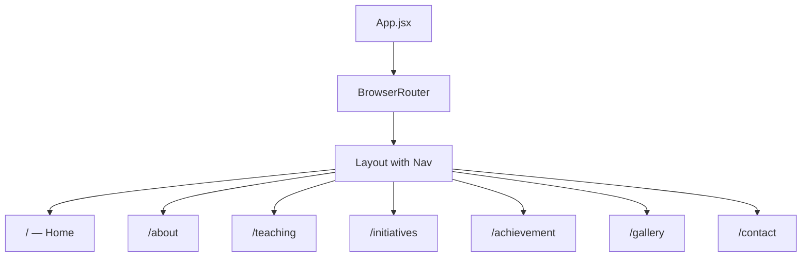
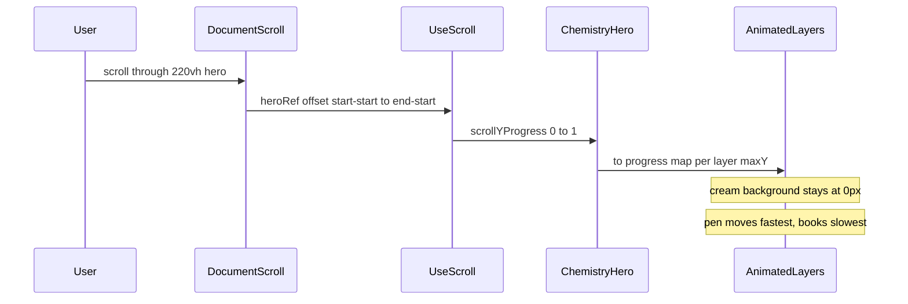

# React + Vite Parallax Project Setup

## Context

The workspace is greenfield: only planning docs exist ([reference/Chemistry Teacher Parallax Hero I.txt](reference/Chemistry Teacher Parallax Hero I.txt), [reference/profile-info.md](reference/profile-info.md), [public/parallax/## Parallax Hero Asset List.txt](public/parallax/## Parallax Hero Asset List.txt)). No `package.json` or source code yet.

Your reference brief defines a **Firewatch-style sticky hero** (220vh outer wrapper, 100vh sticky stage, `#F3EFE5` background, per-layer `translate3d` transforms driven by scroll progress 0→1).

**Parallax library:** [React Spring](https://www.react-spring.dev/) via **`@react-spring/web`** — using `useScroll` to track hero scroll progress and `animated` components to apply GPU-accelerated transforms per layer.

**Why `@react-spring/web` instead of `@react-spring/parallax`:** The brief requires normal **document scroll** with a **CSS sticky stage** inside a 220vh wrapper. The `@react-spring/parallax` `Parallax` component creates its own scroll container and replaces window scroll — that conflicts with the Firewatch transition into normal page content below. `useScroll` scoped to the hero ref is the correct fit.

**Your choices:** JavaScript (not TypeScript), React Router included from the start, React Spring for parallax.

---

## 1. Scaffold Vite + React (JavaScript)

Run in the project root, preserving existing files:

```bash
npm create vite@latest . -- --template react
npm install
```

This creates the standard Vite layout:

```text
index.html
vite.config.js
src/main.jsx
src/App.jsx
src/index.css
public/          # merges with existing public/parallax/
```

**Note:** Vite may warn about a non-empty directory — proceed and keep `reference/` and `public/parallax/` untouched.

---

## 2. Install parallax + routing dependencies

```bash
npm install @react-spring/web react-router-dom
```

| Package | Purpose |
|---------|---------|
| **@react-spring/web** | `useScroll` for 0→1 hero progress; `animated` + `to()` for per-layer `translate3d` transforms |
| **react-router-dom** | Multi-page nav from [profile-info.md](reference/profile-info.md) |

**Not installing:** GSAP, `@react-spring/parallax`, Lenis, Framer Motion — React Spring covers scroll-linked transforms; the parallax package's scroll-container model doesn't match this hero pattern.

---

## 3. Global styles and design tokens

Update [src/index.css](src/index.css) with project foundations from the brief:

- Page background: `#F3EFE5`
- CSS reset / box-sizing
- Base typography (system font stack initially; can swap to a Google Font later)
- `prefers-reduced-motion: reduce` baseline (required by brief §16)

Define CSS custom properties for reuse:

```css
:root {
  --color-cream: #F3EFE5;
  --hero-height: 220vh;
}
```

---

## 4. React Router + page shell

Create a layout with the nav items from the profile spec:

**Home | About Me | Teaching & Learning | Initiatives | Student Achievement | Gallery | Contact**



**Files to add:**

| File | Role |
|------|------|
| [src/App.jsx](src/App.jsx) | Router config + route definitions |
| [src/components/Layout/Layout.jsx](src/components/Layout/Layout.jsx) | Shared nav + `<Outlet />` |
| [src/components/Layout/Layout.css](src/components/Layout/Layout.css) | Nav styling on cream background |
| [src/pages/Home.jsx](src/pages/Home.jsx) | Hero placeholder + intro content section |
| [src/pages/About.jsx](src/pages/About.jsx) | Placeholder |
| [src/pages/Teaching.jsx](src/pages/Teaching.jsx) | Placeholder |
| [src/pages/Initiatives.jsx](src/pages/Initiatives.jsx) | Placeholder |
| [src/pages/Achievement.jsx](src/pages/Achievement.jsx) | Placeholder |
| [src/pages/Gallery.jsx](src/pages/Gallery.jsx) | Placeholder |
| [src/pages/Contact.jsx](src/pages/Contact.jsx) | Placeholder |

Each placeholder page gets a heading + short "coming soon" text. **Home** is special: it hosts the parallax hero.

---

## 5. Chemistry hero component stub (Stage 1 prep)

Create the DOM skeleton from brief §7 — static structure only, React Spring wiring stubbed:

```text
chemistry-hero          (height: 220vh; ref for useScroll target)
├── sticky-stage        (position: sticky; top: 0; height: 100vh; bg: #F3EFE5)
│   ├── desk-background
│   ├── animated layer slots for each asset
│   └── hero-copy       (HTML text: name, subtitle, scroll prompt)
└── (scroll range implicit in 220vh height)
```

**Files:**

| File | Role |
|------|------|
| [src/components/ChemistryHero/ChemistryHero.jsx](src/components/ChemistryHero/ChemistryHero.jsx) | Hero wrapper, `useHeroScroll`, `animated` layer markup |
| [src/components/ChemistryHero/ChemistryHero.css](src/components/ChemistryHero/ChemistryHero.css) | Sticky stage, z-index stack, absolute positions from brief §8–9 |
| [src/components/ChemistryHero/layers.js](src/components/ChemistryHero/layers.js) | Layer config (id, z-index, placement, maxY from brief §10) |
| [src/components/ChemistryHero/ParallaxLayer.jsx](src/components/ChemistryHero/ParallaxLayer.jsx) | Thin wrapper: maps scroll progress → `animated` transform style |

Hero copy (placeholder until real name is confirmed):

```text
Mr. Carter
Chemistry, explained clearly.
Scroll to begin
```

Below the hero on Home, add a **content section** also using `#F3EFE5` so the seamless transition target exists (brief §2).

**Asset path:** create `public/images/chemistry-hero/` with a `.gitkeep`. Layer `` tags will point here once WebP assets are processed (brief §6). For now, use colored placeholder divs so layout can be validated without assets.

---

## 6. React Spring scroll hook (ready for Stage 2)

| File | Role |
|------|------|
| [src/hooks/useHeroScroll.js](src/hooks/useHeroScroll.js) | `useScroll` scoped to hero ref; returns `scrollYProgress` (0→1) |
| [src/hooks/useReducedMotion.js](src/hooks/useReducedMotion.js) | Reads `prefers-reduced-motion`; disables spring motion when true |

**Initial wiring (Stage 1 stub):**

```jsx
import { useRef } from 'react'
import { useScroll } from '@react-spring/web'

export function useHeroScroll() {
  const heroRef = useRef(null)
  const { scrollYProgress } = useScroll({
    target: heroRef,
    offset: ['start start', 'end start'],
  })
  return { heroRef, scrollYProgress }
}
```

**Stage 2 transform mapping (preview):** each layer interpolates progress to its brief §10 offset:

```jsx
import { animated, to } from '@react-spring/web'

// pen: max upward movement -780px
<animated.div
  style={{
    transform: to(scrollYProgress, (p) => `translate3d(0, ${p * -780}px, 0)`),
  }}
/>
```

Spring config for scroll-linked motion: use **`immediate: true`** (or `config: { duration: 0 }`) so layers track scroll 1:1 without lag — the brief calls for direct scroll coupling, not bouncy springs. Reserve spring physics only for optional micro-interactions (e.g. scroll arrow pulse) if desired later.

**Reduced motion:** when `useReducedMotion()` is true, skip transform interpolation and show static composition + simple fade into content section (brief §16).

In `ChemistryHero.jsx`, wire the hook and render layers as `animated.div` elements with transforms pinned at `0` until assets are placed — confirms integration without full animation tuning.

---

## 7. Vite config tweak

In [vite.config.js](vite.config.js), ensure `public/` serves correctly (default behavior). Optionally add a path alias:

```js
resolve: { alias: { '@': '/src' } }
```

This keeps imports clean (`@/components/...`) but is optional — match whatever the scaffold generates.

---

## 8. Verify

```bash
npm run dev
```

Confirm:
- Dev server starts on `localhost:5173`
- All 7 nav routes render
- Home shows cream hero stub + content section below
- No console errors from React Spring or Router
- `public/parallax/` spec file still present

---

## Out of scope for this step

These come in later stages per brief §18:

- Processing transparent WebP assets (brief §6)
- Full scroll-driven layer transforms and speed tuning (Stage 2)
- Subtle rotation/scale secondary transforms (Stage 3)
- Responsive layer reduction (Stage 4)
- Asset preload + performance optimization (Stage 5)
- Real teacher name / profile content

---

## Architecture preview (Stage 2 parallax)


